# Launchbox_FuzzleBadges
An extension plugin that adds a ton of badges for launchbox for things like source versions, platforms, and some misc custom values and tracking. 
Some are simple replacements for existing ones but I wanted my own icon embeded in so I made a duplicate badge.

### If you don't want all of these, just recompile it and exclude the classes you don't want (or just turn them off in launchbox)

###### Has some issues with the indexing, seems to be fairly random and Launchbox is ignoring my prescribed values, maybe I have too many on a single index?

## Misc Functional
* **Overwrite Icon for Game Completed**

&emsp;&emsp;&emsp;&emsp;
> Because a gold trophy is better

* **Overwrite Icon for Favorite**

&emsp;&emsp;&emsp;&emsp;
> Purple Ribbons!

* **Overwrite Icon for Installed (needs download)**

&emsp;&emsp;&emsp;&emsp;
> Need to download this game!

* **Custom Field "Needs Purchase" == True, display a money sign** 

&emsp;&emsp;&emsp;&emsp;
> This is to keep track of games that I plan to buy in the future

* **Custom Field "100% Completed" == True, display a platinum trophy** 

&emsp;&emsp;&emsp;&emsp;
> To keep track of the games you platinum

* **Replacement for "New" Badge**

&emsp;&emsp;&emsp;&emsp;
> Checks to see if the game has a lastplayed value, if its null the badge will display, otherwise it won't, 

> allows for marking several games as played without tediously launching them all by simply setting them all to a last played date

## Pc Source Libraries

* Amazon Games
* Battle.Net/Blizzard App
* Epic Games Store/Epic Games Launcher
* GOG/GOG Galaxy
* Origin
* Steam
* Ubisoft Connect/Uplay
* Xbox Game Pass/Microsoft Store

## Consoles/Portables

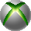

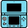
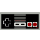
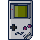
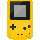
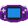

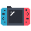
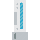

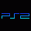

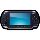
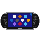
* Microsoft Xbox
* Microsoft Xbox 360
* Nintendo 3DS
* Nintendo 64
* Nintendo DS
* Nintendo Entertainment System
* Super Nintendo Entertainment System
* Nintendo Gameboy
* Nintendo Gameboy Color
* Nintendo Gameboy Advance
* Nintendo Gamecube
* Nintendo Switch
* Nintendo Wii
* Nintendo WiiU
* Sony Playstation
* Sony Playstation 2
* Sony Playstation 3
* Sony Playstation 4
* Sony Playstation Portalble (PSP)
* Sony Playstation Vita

## In Launchbox

